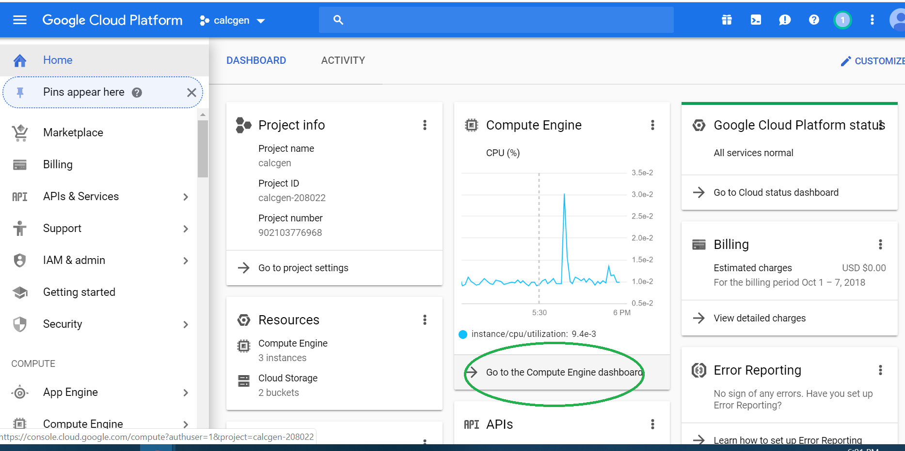
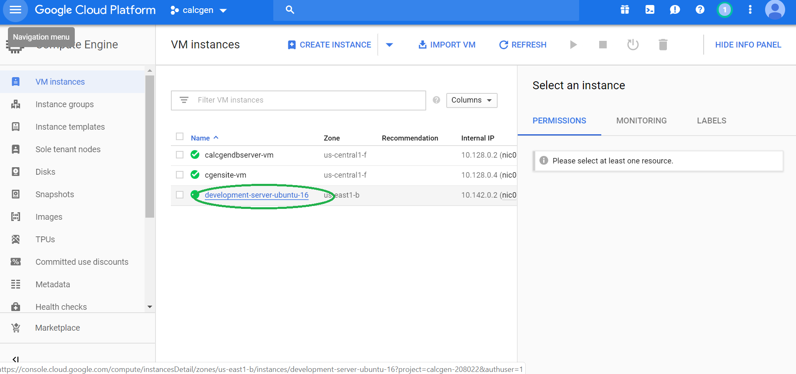
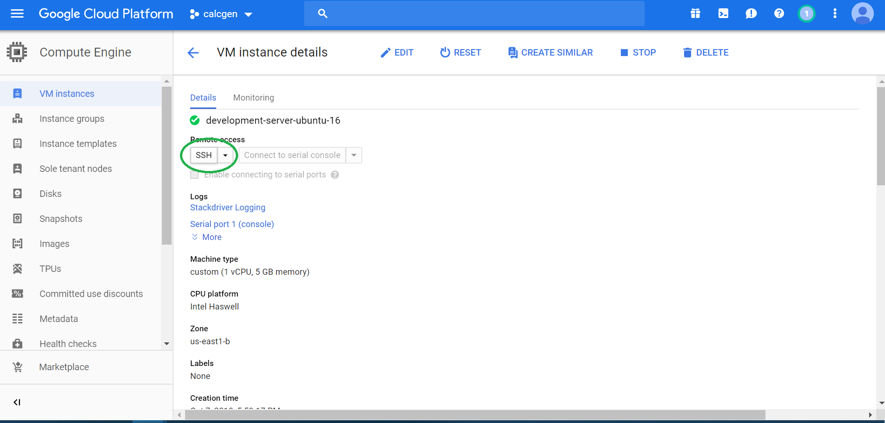
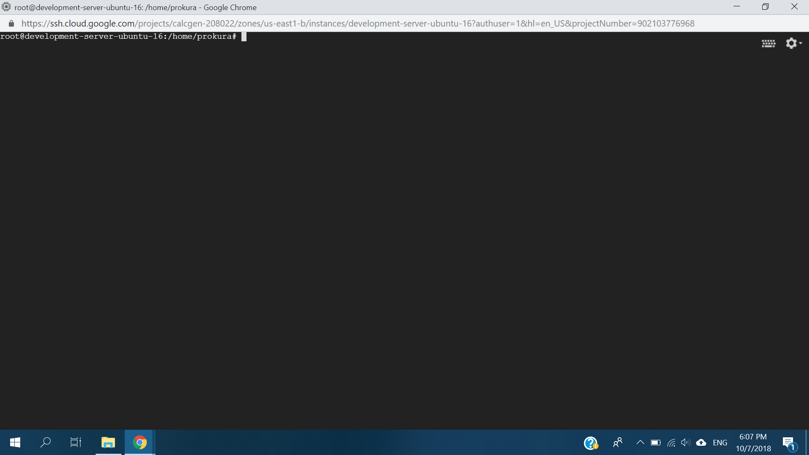

# pressureVessel in Google Cloud
## dependencies
### Acessing cloud instance
- steps
1.
2.
3.
4.

### Uploading files
- file
```bash
gcloud compute scp  E:/index.js  prokura@development-server-ubuntu-16:/home/prokura/
```
 - folder
```bash
gcloud compute scp --recurse  E:/test  prokura@development-server-ubuntu-16:/home/prokura/
```


### Downloading files
- file
```bash
gcloud compute scp   prokura@development-server-ubuntu-16:/home/prokura/test/index.js E:/test
```
- folder
```bash
gcloud compute scp --recurse prokura@development-server-ubuntu-16:/home/prokura/test E:/
```

## Backend Packages
- selected django framework for backend

Packgae | Version
------------ | -------------
python | 3.6.4
Django        |            2.1.1
django-cors-headers      | 2.4.0
djangorestframework    |   3.8.2
conda | 4.4.10

## Frontend Packages
Packgae | Version
------------ | -------------
react | 3.6.4

## Database Essentials
- install postgres-10
### Exporting local db
- export to a file in local
```bash
pg_dump -U nic vesseldb > dbexport.pgsql
```
- upload file to gcloud
```
gcloud compute scp  dbexport.pgsql prokura@development-server-ubuntu-16:/home/prokura/db_import
```
- enter password on prompt
```prokura```
